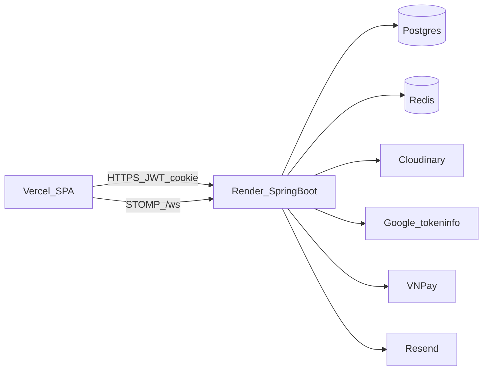

# Easy Mart API — Spring Boot + JWT

Backend REST cho cửa hàng Easy Mart: xác thực JWT/Google, catalog (cache Redis), đơn hàng + phí ship, thanh toán COD/VNPay, profile & sổ địa chỉ, realtime WebSocket, upload ảnh Cloudinary.

| | URL |
|--|--|
| **Frontend** | https://easy-mart-vert.vercel.app/ |
| **Backend (Render)** | https://javabackend-olfp.onrender.com |
| **Swagger UI** | https://javabackend-olfp.onrender.com/swagger-ui/index.html |
| **OpenAPI JSON** | https://javabackend-olfp.onrender.com/v3/api-docs |
| **GitHub** | https://github.com/HoangDVH/javabackend |

Base path API: **`/api/v1`**.

---

## 1. Công nghệ & stack

### Runtime & framework

| Thành phần | Chi tiết |
|------------|----------|
| **Java** | 17 |
| **Spring Boot** | 3.2.5 |
| **Spring Web** | REST controllers, validation (`jakarta.validation`) |
| **Spring Data JPA** | Hibernate, `ddl-auto: update`, `open-in-view: false` |
| **Spring Security** | OAuth2 Resource Server + JWT HS256 (JJWT 0.11.5) |
| **Spring WebSocket** | STOMP over SockJS (`/ws`), Simple Broker |
| **Spring Data Redis** | Template thủ công (auto-config Redis tắt khi không cần) |
| **Lombok** | Boilerplate entity/DTO/service |
| **springdoc-openapi** | 2.5.0 — Swagger UI + OpenAPI 3 |

### Dữ liệu & hạ tầng

| Thành phần | Chi tiết |
|------------|----------|
| **MySQL 8** | Dev local (mặc định port `3307`, DB `jwtjava`) |
| **PostgreSQL** | Production (Render / Neon / … qua `DATABASE_URL` → JDBC) |
| **H2** | In-memory cho test (`application-test.yaml`) |
| **HikariCP** | Pool nhỏ cho Free tier (`maximum-pool-size` ~8) |
| **Redis** | JWT blacklist, rate limit, catalog cache (fail-open nếu lỗi) |
| **Docker + Render Blueprint** | `Dockerfile` + `render.yaml` (web + Redis Key Value Free) |

### Tích hợp bên ngoài

| Dịch vụ | Mục đích |
|---------|----------|
| **Google Identity Services** | Đăng nhập bằng Google ID token (`tokeninfo`) |
| **VNPay Sandbox v2.1.0** | Thanh toán online (HMAC-SHA512, IPN) |
| **Cloudinary** | Upload ảnh sản phẩm → `secure_url` |
| **Resend** | Email quên mật khẩu (HTTPS API, tương thích Render Free) |
| **Vercel** | Host FE SPA; CORS + cookie refresh cross-site |

### Thư viện / công cụ hỗ trợ

- **JJWT** (`jjwt-api` / `impl` / `jackson`) — tạo & parse JWT
- **Cloudinary Java SDK** `cloudinary-http44` 1.38.0
- **MySQL / PostgreSQL / H2** JDBC drivers
- **k6** (script `tools/k6/catalog-smoke.js`) — smoke load test catalog
- **Maven Wrapper** (`jwtjava/mvnw`)

---

## 2. Kiến trúc tổng quan



- **1 instance** web Docker trên Render Free (+ Redis Free + Postgres ngoài).
- Catalog đọc nhiều → **Redis cache** + chống stampede.
- Ghi đơn/thanh toán → **rate limit soft** + trừ kho **atomic**.

---

## 3. Vai trò người dùng (RBAC)

| Role | Quyền chính |
|------|-------------|
| **USER** | Mặc định khi đăng ký; mua hàng, địa chỉ, thanh toán, xem đơn của mình |
| **SELLER** | CRUD sản phẩm của mình; xem đơn chứa SP mình bán; cập nhật fulfillment từng bước |
| **ADMIN** | Quản user/role; mọi sản phẩm; `?sellerEmail=` xem hộ seller; diagnostics VNPay |

JWT claim `scope` = danh sách role (space-separated) → Spring `ROLE_*`. Seed admin: `admin@gmail.com` (đổi mật khẩu qua env).

---

## 4. Chức năng chi tiết

### 4.1 Xác thực & phiên

- **Đăng ký / đăng nhập** email + mật khẩu (BCrypt).
- **Access token** JWT (~1 giờ) trong JSON; **refresh token** (~10 giờ) qua cookie HttpOnly `refresh_token` (path auth).
- **Refresh**: `POST /auth/refresh` — không body, đọc cookie, rotate cookie.
- **Logout**: invalidate access (blacklist Redis + fallback DB `invalidated_tokens`).
- **Introspect**: kiểm tra token còn hợp lệ.
- **Google Sign-In**: FE GIS → `POST /auth/google` `{ "idToken" }` → verify audience `GOOGLE_CLIENT_ID` → tìm/tạo user (email, fullName, **avatarUrl**) → cùng JWT + refresh cookie như login.
- **Quên mật khẩu**: Resend gửi link SPA (`APP_FRONTEND_RESET_URL`); token one-time TTL 30 phút (Redis hoặc bảng `password_reset_tokens`).

### 4.2 Profile & sổ địa chỉ

- `GET/PUT /users/me` — `fullName`, `phone`, `avatarUrl`, đổi mật khẩu (khi có).
- CRUD `/users/me/addresses` — label, người nhận, SĐT, địa chỉ, **`isDefault`** (một mặc định / user).
- Admin: CRUD user, gán role `PATCH /users/{id}/roles`.

### 4.3 Danh mục & sản phẩm (catalog)

- **Public GET** categories & products (không cần JWT).
- Product list: filter `categoryId`, `brandId`, `isFeatured`, `keyword`, `minPrice`/`maxPrice`, `minRating`, `hasDiscount`, `inStock` + phân trang/sort.
- Seller/Admin: tạo/sửa/xóa SP (JSON hoặc **multipart** kèm ảnh); upload riêng `POST /products/images`.
- Ảnh: Cloudinary (ưu tiên) hoặc local `uploads/` phục vụ `GET /files/product-images/**`.
- **Redis catalog cache**: list/detail product TTL ~120s, category ~1800s; version key invalidate khi CRUD; **stampede lock** (1 request load DB, request khác đợi ngắn).
- Startup: seed 6 category + 50 SP mẫu; backfill ảnh legacy nếu bật.

### 4.4 Đơn hàng & vận chuyển

- Tạo đơn: `items[]` + `receiverName` + `receiverPhone` + `shippingAddress`.
- **Phí ship**: 30.000₫ nếu subtotal &lt; 500.000₫; **miễn phí** từ 500.000₫; `totalAmount = subtotal + shippingFee`.
- Trạng thái đơn: `PENDING_PAYMENT` → `PAID` | `CANCELLED`.
- **Trừ kho atomic**: `UPDATE stock = stock - qty WHERE stock >= qty` (0 row → `OUT_OF_STOCK`); hủy đơn `PENDING_PAYMENT` → hoàn kho + hủy payment PENDING.
- Lịch sử trạng thái đơn (`OrderStatusHistory`).
- Seller: `GET /orders/seller/history`; `PATCH …/seller-status` — fulfillment tuần tự:  
  `AWAITING_CONFIRMATION` → `CONFIRMED` → `PROCESSING` → `SHIPPED` → `DELIVERED` (không skip bước).

### 4.5 Thanh toán

- **COD / CASH** (`POST /payments`): đánh dấu payment SUCCESS + order PAID ngay; **idempotent** nếu đã có SUCCESS.
- **VNPay**: `POST /payments/vnpay` → `paymentUrl`; user thanh toán sandbox; **IPN** `GET /payments/vnpay/ipn` (public, verify chữ ký) → PAID; tái sử dụng payment PENDING; chặn thanh toán trùng khi đã SUCCESS.
- Seller xem lịch sử payment lọc theo item của mình.
- Admin: `GET /payments/vnpay/diagnostics`.

### 4.6 Realtime (WebSocket)

- Endpoint: **`/ws`** (STOMP).
- CONNECT kèm `Authorization: Bearer <accessToken>`.
- Subscribe: **`/user/queue/orders`**.
- Sự kiện: `ORDER_CREATED`, `ORDER_STATUS_CHANGED`, `FULFILLMENT_STATUS_CHANGED`.
- Seller nhận đơn có line của mình; buyer nhận full order.
- Chi tiết: [`jwtjava/REALTIME_ORDERS.md`](jwtjava/REALTIME_ORDERS.md).

### 4.7 Bảo vệ tải & quan sát (Anti-lag Phase 0–2)

| Cơ chế | Mô tả |
|--------|--------|
| Slow request log | WARN khi request ≥ `SLOW_REQUEST_MS` (mặc định 1000ms) |
| Catalog stampede | Redis lock ngắn khi cache miss |
| Hikari + Tomcat | Pool/threads giới hạn cho Free RAM |
| Soft rate limit | POST auth + tạo đơn + tạo thanh toán theo IP; GET catalog **không** limit |
| Fail-open | Redis tắt/lỗi → API vẫn chạy (không chặn cứng) |
| FE retry | 429 → đọc `Retry-After` + backoff (ghi trong OpenAPI) |

**Phase 3** (nâng Render/Postgres/Redis paid) — *chưa làm*; Free vẫn có cold start ~15 phút idle.

### 4.8 OpenAPI / Swagger

- UI: `/swagger-ui.html`
- JWT scheme **bearer-jwt**; tag sắp xếp Authentication → Categories → Products → Orders → Payments → Users.
- Mô tả rate limit, shipping, Google, VNPay trong `OpenApiConfig`.

---

## 5. API tóm tắt theo nhóm

**Public (không JWT):**  
`GET /products/**`, `GET /categories/**`, `GET /files/**`, `POST` auth register/login/google/refresh/introspect/forgot/reset, `GET /payments/vnpay/ipn`, `/ws/**` (handshake; message cần token), Swagger.

### Auth — `/api/v1/auth`

| Method | Path | Ghi chú |
|--------|------|---------|
| POST | `/register` | Public |
| POST | `/login` | Public → accessToken + cookie refresh |
| POST | `/google` | Public — `{ idToken }` |
| POST | `/forgot-password`, `/reset-password` | Public |
| POST | `/introspect`, `/refresh` | Public |
| POST | `/logout` | JWT |

### Users & addresses

| Method | Path | Role |
|--------|------|------|
| GET/PUT | `/users/me` | JWT |
| CRUD | `/users/me/addresses` | JWT |
| CRUD + roles | `/users`, `/users/{id}`, `…/roles` | ADMIN |

### Categories & products

| Method | Path | Role |
|--------|------|------|
| GET | `/categories`, `/categories/{id}` | Public |
| GET | `/products`, `/products/{id}` | Public |
| GET | `/products/seller/my` | SELLER/ADMIN |
| POST/PUT/DELETE | `/products…`, `/products/images` | SELLER/ADMIN |

### Orders & payments

| Method | Path | Role |
|--------|------|------|
| POST/GET/cancel | `/orders…` | USER/SELLER/ADMIN |
| GET/PATCH seller | `/orders/seller/history`, `…/seller-status` | SELLER/ADMIN |
| POST/GET | `/payments` | USER/SELLER/ADMIN |
| POST | `/payments/vnpay` | JWT |
| GET | `/payments/vnpay/ipn` | Public |
| GET | `/payments/vnpay/diagnostics` | ADMIN |

---

## 6. Mô hình dữ liệu (domain)

| Entity | Nội dung chính |
|--------|----------------|
| **User** | UUID, email, password, fullName, phone, avatarUrl, roles |
| **UserAddress** | Người nhận, SĐT, địa chỉ, isDefault |
| **Category** | code, name |
| **Product** | giá / discountPrice, stock, category, brandId, sellerEmail, images, rating, featured |
| **Order** | items, subtotal, shippingFee, totalAmount, thông tin nhận hàng, status |
| **OrderItem** | snapshot SP, sellerEmail, fulfillmentStatus |
| **OrderStatusHistory** | old/new status, changedAt, changedBy |
| **Payment** | method, amount, status, transactionRef |
| **InvalidatedToken** | JWT đã logout / revoke |
| **PasswordResetToken** | hash token + expiry |

**Enums:**  
`OrderStatus` · `PaymentStatus` · `FulfillmentStatus` (chuỗi fulfillment ở trên).

---

## 7. Soft rate limit (chi tiết)

Chỉ áp dụng **POST**, đếm theo IP trên Redis (cửa sổ thời gian cố định).

| Endpoint | Mặc định (gần đúng) |
|----------|---------------------|
| Login / Google | 10 / 60s |
| Register | 5 / 300s |
| Forgot password | 5 / 900s |
| Refresh | 20 / 60s |
| **Create order** | **20 / 60s** |
| **Create payment / VNPay** | **20 / 60s** |

Vượt ngưỡng → **HTTP 429**, body lỗi chuẩn, header `Retry-After`, `X-RateLimit-Remaining`.

---

## 8. Seed, migration & startup

| Runner | Việc |
|--------|------|
| `AdminUserSeeder` | Tạo admin nếu chưa có |
| `EcommerceDataSeeder` | 6 category + 50 sản phẩm mẫu |
| `ProductCatalogImageBackfill` | Thay ảnh local cũ / Picsum khi cấu hình |
| `DbSchemaMigrationRunner` | Index/trigger SQL khi `APP_DB_RUN_SQL_MIGRATIONS_ON_STARTUP=true` |
| `VnpayConfigLogger` | Log trạng thái cấu hình VNPay |

SQL trong `classpath:sql/` (MySQL/Postgres). JPA vẫn `ddl-auto: update`.

---

## 9. Kiểm thử

| Test | Phạm vi |
|------|---------|
| `ApiIntegrationTest` | Catalog public, login |
| `VnpayFlowIntegrationTest` | Order → VNPay URL → IPN giả → PAID |
| `VnpaySignatureUtilTest` | Chữ ký HMAC |
| `PaymentServiceTest` | COD idempotent |
| `OrderServiceTest` | Fulfillment theo seller |
| `OrderShippingServiceTest` / `ShippingFeeCalculatorTest` | Phí ship |
| `OrderRealtimeNotifierTest` | Push WS |
| `GoogleAuthServiceTest` | Google login |
| `UserProfileAndAddressServiceTest` | Profile + địa chỉ |
| `JwtjavaApplicationTests` | Context load |

```bash
cd jwtjava
./mvnw test
```

---

## 10. Chạy local

### Yêu cầu

- JDK 17+
- MySQL 8 **hoặc** H2 qua `application-local.yaml`
- Redis (khuyến nghị; tắt được bằng `REDIS_ENABLED=false`)

### Lệnh

```bash
cd jwtjava
./mvnw spring-boot:run
```

App: http://localhost:8080 — Swagger: http://localhost:8080/swagger-ui.html

Copy `src/main/resources/application-local.example.yaml` → `application-local.yaml` (đã gitignore) để ghi đè DB, VNPay, Google, Cloudinary, …

### IDE (IntelliJ)

- Mở **repo gốc**, Reload Maven; Run config module = **`jwtjava`** (không phải aggregator).
- Lombok + Annotation Processing; Project SDK 17.

### CORS & cookie (SPA)

Origins: `localhost:5173`, `localhost:3000`, `https://easy-mart-vert.vercel.app`.  
Gọi auth từ browser cần `credentials: "include"`. Production Render: `SameSite=None` + `Secure=true` cho refresh cookie.

---

## 11. Biến môi trường chính

| Biến | Mục đích |
|------|----------|
| `DATABASE_URL` / `JWTJAVA_DATASOURCE_*` | Postgres prod / MySQL local |
| `JWT_SIGNER_KEY` | Base64 256-bit HS256 |
| `REDIS_*` / `REDIS_ENABLED` | Cache, rate limit, blacklist |
| `HIKARI_MAX_POOL_SIZE`, `JPA_SHOW_SQL`, `SLOW_REQUEST_MS` | Pool & quan sát |
| `RATE_LIMIT_ENABLED`, `CATALOG_CACHE_ENABLED` | Soft limit & cache |
| `GOOGLE_AUTH_ENABLED`, `GOOGLE_CLIENT_ID` | Google Sign-In |
| `VNPAY_*` | Cổng VNPay |
| `CLOUDINARY_*` | Upload ảnh |
| `MAIL_ENABLED`, `RESEND_API_KEY`, `APP_FRONTEND_RESET_URL` | Quên MK |
| `APP_SEED_ADMIN_*` | Admin seed |
| `JWT_REFRESH_COOKIE_SAME_SITE`, `JWT_REFRESH_COOKIE_SECURE` | Cookie cross-site |

---

## 12. Deploy Render

1. Push GitHub → Blueprint `render.yaml` (web Docker + Redis Free).
2. Gắn Postgres ngoài → `DATABASE_URL`.
3. Điền secrets (JWT, Cloudinary, VNPay, Google, Resend, …).
4. Auto convert `DATABASE_URL` → JDBC Postgres lúc start.

### Free tier sleep

- Sleep sau ~**15 phút** không traffic → cold start ~30–60s.
- Giữ thức tạm: ping HTTP mỗi 10–14 phút (UptimeRobot…) — vẫn tính **750 Free hours/tháng**.
- Không sleep thật: nâng **Starter** hoặc tự host VM (vd Oracle Always Free).

### Load test nhanh (k6)

```powershell
Invoke-WebRequest "https://javabackend-olfp.onrender.com/api/v1/products?page=0&size=1" -TimeoutSec 120
$env:VUS="3"; $env:DURATION="30s"
.\tools\k6\k6-v1.3.0-windows-amd64\k6.exe run .\tools\k6\catalog-smoke.js
```

(Binary k6 không commit — chỉ script `tools/k6/catalog-smoke.js`.)

---

## 13. Cấu trúc repo

```
jwtjava/                 # Module Spring Boot (chính)
  src/main/java/...      # Controllers, services, entities, config
  src/main/resources/    # application.yaml, sql/, …
  REALTIME_ORDERS.md     # Hướng dẫn WebSocket FE
tools/k6/                # Script smoke load test
render.yaml              # Blueprint Render
Dockerfile
README.md                # File này
```

Aggregator Maven ở thư mục gốc — IDE nên mở **toàn repo**.

---

## License

Dự án mẫu / nội bộ — bổ sung file `LICENSE` nếu public hóa repo.
